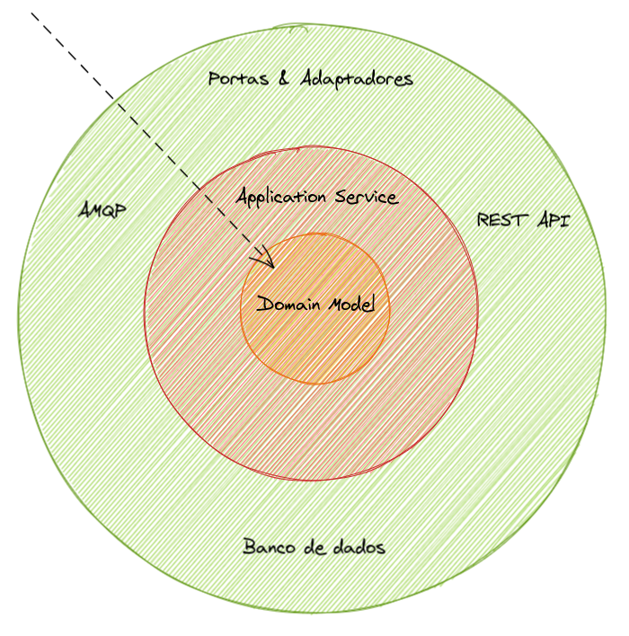

# CONSTRUÇÃO DE OBJETOS


## Contextualização

Considerando o contexto de uma arquitetura hexagonal onde a camada de domínio deve concentrar as regras de negócio, a construção de objetos muitas vezes escapam da onde deveriam estar e acabam pertecendo as camadas superiores, comumente na camada de aplicação.

 

## Exemplo

Para ilustrar a situação, criamos um exemplo hipotético que consiste de duas entidades, Cliente e Pedido. Considere que quando um cliente fica 12 meses sem realizar compras sua situação é alterada de ativo para inativo. Apesar de inativo, o cliente pode realizar novas compras, porém, o pedido deve passar por um processo de aprovação. Quando cliente ativo, o pedido já nasce aprovado. Considere também que o caso de uso consiste em selecionar um cliente e entre outras opções existe a opção criar pedido. 


## Uma primeira implementação


```
public class ClienteService {

    //...

    public String handle(CriarPedido cmd) {

        Cliente cliente = clienteRepository.findById(cmd.getClienteId()).orElseThrow();

        Pedido pedido = cliente.isAtivo() 
                ? new Pedido(cliente.getId(), SituacaoPedido.APROVADO)
                : new Pedido(cliente.getId(), SituacaoPedido.AGUARDANDO_APROVACAO);

        pedidoRepository.save(pedido);

        return pedido.getId();
        
    }
    
    //...

}
```

  * O que há de errado com esta implementação?

    * A regra de criação do pedido a partir de um cliente escapou da camada de domínio e passou a fazer parte da camada de aplicação. Conforme comentado anteriormente, sempre que possível, decisões com base em regra de negócio devem ser encapsuladas na camada de domínio. 
    * Outro ponto importante é que, sempre que possível vale a pena esconder os detalhes de implementações de um determinado objeto, veja que, além de tomar a decisão de criar um pedido aprovado ou aguardndo aprovação, quem cria o pedido deve conhecer os valores dos enums referente as situações.  
  
## A implementação que soluciona os problemas seguindo a organização do projeto
  
```
public class ClienteService {

    //...

    public String handle(CriarPedido cmd) {

        Cliente cliente = clienteRepository.findById(cmd.getClienteId()).orElseThrow();

        Pedido pedido = cliente.criarPedido();

        pedidoRepository.save(pedido);

        return pedido.getId();

    }
    
    //...
    
}

```

  * Vantagens
    * A regra de negócio fica encapsulada no domínio, a camada de aplicação fica responsável somente por conduzir o caso de uso, que neste caso consiste em buscar o cliente e pedir a criação de um novo pedido.
      
```
public class Cliente {

    //...

    // método fábrica responsável por fabricar um novo pedido a partir de um cliente.
    public Pedido criarPedido() {

        return this.isAtivo() 
                ? Pedido.aprovado(this.id)
                : Pedido.aguardandoAprovacao(this.id);
                
    }
    
    //...
}    

```

  * O cliente por sua vez, sabe como um pedido deve ser criado de acordo com suas condições. 
  
```
public class Pedido { 

    //...

    // métodos de fábrica estáticos responsáveis por disponibilizar as formas de criação de um pedido.
            
    public static Pedido aprovado(String clienteId) {
        return new Pedido(clienteId, SituacaoPedido.APROVADO);
    }

    public static Pedido aguardandoAprovacao(String clienteId) {
        return new Pedido(clienteId, SituacaoPedido.AGUARDANDO_APROVACAO);
    }
    
    //...
}    

```

  * O pedido por sua vez disponibiliza as possíveis formas em que pode ser criado escondendo detalhes de implementações, isso reduz a dependência de outras entidades para com o pedido.
  


###### Observação: O exemplo apresentado foi criado especificamente com o objetivo de demonstrar a utilização de métodos de fábrica estático e não estático. No mundo real é possível que as mesmas condições não se apliquem. O importante é entender o potencial dos métodos de fábrica para explicitar intenções e esconder detalhes de implementações para reduzir acoplamento para que então possa ser aplicado em seu cenário específico. 
  
     


